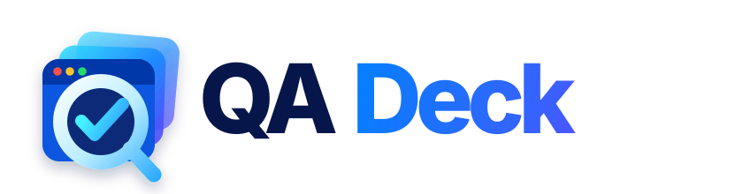

<p align="center">
  
</p>

<p align="center"><strong>Self-hosted web QA automation for browser tests, visual regression, accessibility, scenarios, performance and reports.</strong></p>

# QADeck

QADeck is a self-hosted, Docker-first web QA platform powered by Playwright. It runs background browser/API tests, captures screenshots/video/traces, checks UI regressions, accessibility and performance, and keeps results in one dashboard.

## QADeck v0.5

### Core QA
- Multi-project dashboard and persistent background queue
- Safe same-origin crawl mode
- HTTP 4xx/5xx, JavaScript, console, network and broken-image detection
- Responsive checks across desktop, laptop, tablet and mobile profiles
- Visual regression baselines with current/diff screenshots and baseline approval
- Axe accessibility checks
- Performance/Web Vitals-style metrics: TTFB, load, LCP and CLS with a per-project performance budget
- Full-page screenshots, Playwright traces and browser videos
- Professional compact A4 PDF/print report export from every run
- Scheduled recurring QA runs
- Automatic stale/interrupted run recovery

### PDF reports
Every run report includes an **Export PDF** action. The print-optimized A4 layout removes dashboard navigation and keeps the QA evidence compact while preserving the full report content:
- Project, run type, run status and timestamps
- Run totals and pass/issue counts
- AI summary when available
- Scenario step results including failed-step evidence
- Full issue list with severity, details, URLs and screenshots
- Page/device screenshots
- Accessibility, visual-regression and performance metrics
- Notification delivery history

In Chrome/Chromium, click **Export PDF** and choose **Save as PDF** in the print dialog. Long reports flow across additional A4 pages instead of truncating report data.

### Login and permissions
- Encrypted default project login
- Unlimited additional login fields such as company, branch, tenant or PIN
- Named test roles per project, e.g. Admin, Staff and Customer
- Each role can have its own login URL, credentials and extra login fields
- Scenarios can select a specific role or run without automatic login

### No-code scenarios
Supported steps:
- Visit URL
- Click
- Fill field
- Select option
- Check / uncheck
- Expect text
- Expect URL
- Wait
- Screenshot
- API GET
- API POST
- Expect API status
- Expect JSON value

Scenario steps can retry up to 3 times. A step that fails first and later passes is marked **flaky** in the report.

### Integrations
- Per-project secure HTTP trigger for CI/CD and deployment scripts
- Generic webhooks
- Discord webhooks
- Telegram notifications
- SMTP email notifications
- Optional OpenAI-compatible AI issue summaries
- Parallel worker scaling with Docker Compose

## Architecture

```text
Browser / CI / Scheduler
          |
          v
     QADeck Web
          |
          v
 SQLite queue/database
          |
     +----+----+
     |         |
 Worker 1   Worker N
     |         |
     +----+----+
          |
  Playwright / Axe / Visual diff
          |
 screenshots / video / traces / reports
```

## Docker quick start

```bash
git clone https://github.com/kasundigital/QADeck.git
cd QADeck
cp .env.example .env
nano .env
docker compose up -d --build
```

Open:

```text
http://SERVER-IP:3000
```

Check services:

```bash
docker compose ps
```

Logs:

```bash
docker compose logs -f qadeck
docker compose logs -f qadeck-worker
```

## Update an existing installation

```bash
cd /opt/QADeck
git pull
docker compose up -d --build
```

The existing `qadeck_data` volume is preserved. QADeck applies additive SQLite migrations on startup.

## Parallel workers

The worker service no longer has a fixed container name, so you can scale browser testing:

```bash
docker compose up -d --scale qadeck-worker=3
```

Start conservatively because each Playwright browser worker uses CPU and RAM.

## CI / deployment trigger

Each project page shows a private trigger path:

```text
POST /hooks/projects/PROJECT_ID/run/TRIGGER_TOKEN
```

A normal POST queues a full crawl. To run a saved scenario, send JSON:

```json
{"scenario_id": 123}
```

Regenerate the token from the project page if it is exposed.

## Optional notifications

Project settings support webhook/Discord URL, Telegram chat ID and notification email.

Telegram requires:

```env
TELEGRAM_BOT_TOKEN=
```

Email requires SMTP settings:

```env
SMTP_HOST=
SMTP_PORT=587
SMTP_SECURE=false
SMTP_USER=
SMTP_PASS=
SMTP_FROM=
```

## Optional AI summaries

QADeck can use an OpenAI-compatible chat-completions endpoint after a run:

```env
AI_BASE_URL=
AI_API_KEY=
AI_MODEL=
```

If these are blank, AI summaries are simply disabled and the rest of QADeck works normally.

## Environment variables

| Variable | Default | Purpose |
|---|---:|---|
| `PORT` | `3000` | Web dashboard port |
| `MAX_PAGES_PER_RUN` | `20` | Pages per selected viewport |
| `PAGE_TIMEOUT_MS` | `20000` | Browser / scenario timeout |
| `WORKER_POLL_MS` | `1500` | Queue poll interval |
| `WORKER_STALE_MINUTES` | `2` | Interrupted-run recovery threshold |
| `SCHEDULE_CHECK_MS` | `30000` | Scheduled-run check frequency |
| `VISUAL_DIFF_THRESHOLD_PCT` | `0.25` | Visual difference threshold |

## Brand assets

QADeck vector assets used by the application are stored under `public/brand/`:

- `qadeck-logo.svg` — standard wordmark for light backgrounds
- `qadeck-logo-light.svg` — wordmark for dark backgrounds
- `qadeck-icon.svg` — app icon / favicon

## Safety

Automatic crawl mode is intentionally read-only and avoids destructive-looking links. Explicit scenarios can click buttons, submit forms and call APIs, so use staging environments or dedicated QA accounts when scenarios can modify data.

## License

No license has been selected yet.
